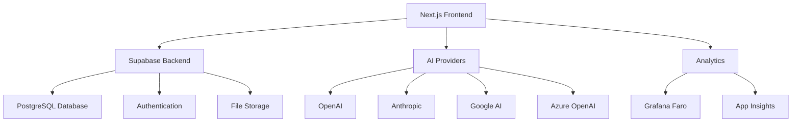

import { Callout, Cards, Card } from 'nextra/components'

# DomusAI Documentation

Welcome to the comprehensive documentation for **DomusAI**, an advanced AI-powered chat interface that enables seamless interaction with multiple AI language models.

<Callout type="info" emoji="🚀">
  DomusAI v2.0 is now available with enhanced features, improved performance, and better user experience!
</Callout>

## What is DomusAI?

DomusAI is a sophisticated chat platform that brings together the power of multiple AI models in a single, intuitive interface. Built with modern web technologies and enterprise-grade security, it provides:

- **Multi-Model Support** - Chat with GPT-4, Claude, Gemini, and more
- **Workspace Organization** - Organize conversations by project or team
- **File Intelligence** - Upload and discuss documents with AI
- **Role-Based Access** - Secure user management and permissions
- **Real-Time Analytics** - Monitor usage and performance
- **Custom Integrations** - Extend functionality with APIs and webhooks

## Quick Start

<Cards>
  <Card icon="👤" title="For Users" href="/user-guides/getting-started">
    Get started with DomusAI as an end user. Learn the interface, create workspaces, and start chatting with AI.
  </Card>
  <Card icon="👨‍💻" title="For Developers" href="/developer/setup">
    Set up a local development environment, understand the architecture, and contribute to the project.
  </Card>
  <Card icon="👨‍💼" title="For Administrators" href="/admin/user-management">
    Manage users, configure system settings, and monitor the platform's health and performance.
  </Card>
  <Card icon="🔌" title="Integrations" href="/integrations/ai-providers">
    Connect AI providers, set up analytics, and integrate with external systems.
  </Card>
</Cards>

## Key Features

### 🤖 Multi-Model AI Chat
- Support for OpenAI, Anthropic, Google, Azure, Mistral, and more
- Model switching within conversations
- Streaming responses for real-time interaction
- Function calling and tool integration

### 🏢 Workspace Management
- Organize conversations by project, team, or topic
- Shared workspaces for collaboration
- Custom settings and instructions per workspace
- Public and private workspace options

### 📁 Intelligent File Handling
- Upload documents, images, spreadsheets, and code
- AI-powered file analysis and discussion
- Vector search across file contents
- File collections and organization

### 🎯 Smart Suggestions
- Pre-built prompt tiles for common tasks
- Contextual suggestions based on conversation
- Custom prompt templates and variables
- Auto-submission for quick interactions

### 📊 Analytics & Monitoring
- Real-time usage statistics
- Performance metrics and insights
- User activity tracking
- Cost analysis and optimization

### 🔒 Enterprise Security
- Role-based access control (RBAC)
- Row-level security policies
- API key management
- Audit logging and compliance

## Architecture Overview

DomusAI is built with a modern, scalable architecture:

### Technology Stack

**Frontend:**
- Next.js 14 with App Router
- React 18 with TypeScript
- Tailwind CSS + Radix UI
- Framer Motion for animations

**Backend:**
- Supabase (PostgreSQL + Auth + Storage)
- Row Level Security (RLS)
- Real-time subscriptions
- Edge functions

**AI Integration:**
- Multiple provider support
- Streaming responses
- Function calling
- Vector embeddings

**Analytics:**
- Grafana Faro for web analytics
- Microsoft Application Insights
- Custom dashboard with charts
- Real-time monitoring

## Getting Help

<Cards>
  <Card icon="❓" title="FAQ" href="/support/faq">
    Find answers to frequently asked questions about DomusAI features and functionality.
  </Card>
  <Card icon="🔧" title="Troubleshooting" href="/support/troubleshooting">
    Resolve common issues and learn debugging techniques for DomusAI.
  </Card>
  <Card icon="💬" title="Community" href="/support/community">
    Join our community forum to connect with other users and get help.
  </Card>
  <Card icon="📧" title="Contact Support" href="/support/contact">
    Get in touch with our support team for technical assistance.
  </Card>
</Cards>

## Contributing

DomusAI is an open-source project and we welcome contributions! Whether you're fixing bugs, adding features, or improving documentation, your help is appreciated.

- **Report Issues** - Found a bug? [Open an issue](https://github.com/your-org/chatbotAI/issues)
- **Submit PRs** - Have a fix or feature? [Submit a pull request](https://github.com/your-org/chatbotAI/pulls)
- **Improve Docs** - Help make our documentation better
- **Join Discussions** - Participate in [GitHub Discussions](https://github.com/your-org/chatbotAI/discussions)

## License

DomusAI is released under the [MIT License](https://github.com/your-org/chatbotAI/blob/main/LICENSE).

---

<Callout type="default" emoji="💡">
  **New to DomusAI?** Start with our [Getting Started Guide](/user-guides/getting-started) to learn the basics, or jump into the [Developer Setup](/developer/setup) if you want to contribute to the project.
</Callout>
